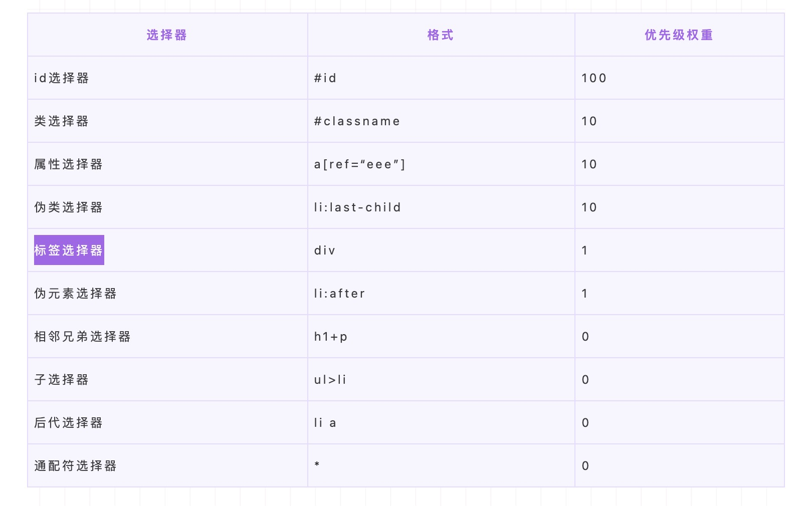
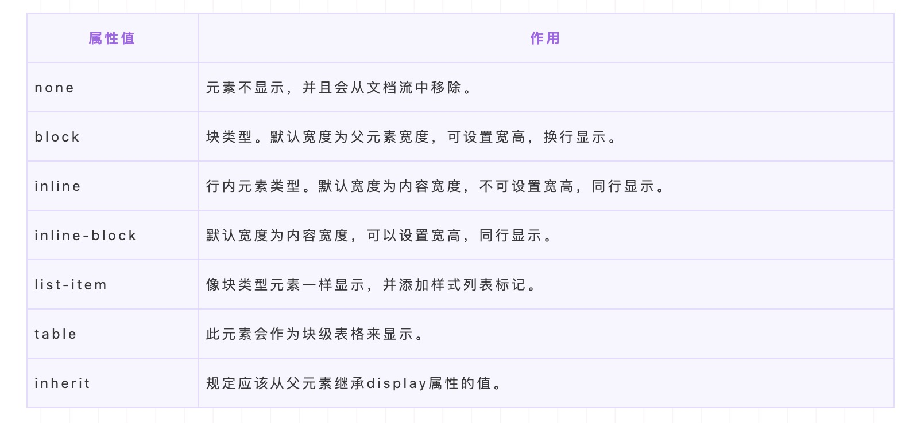

# css 基础部分

## 分类
1. 内联 
2. 内部 
3. 外部 

##  引入方式
1. @import  css 的使用规则
2. link    html 标签

    **区别**
    1. 种类不同
    2. 加载顺序不同
    3. 兼容性问题 
    4. 是否可以通过js操作DOM改变样式

## 选择器
1. id 
2. 类 （class）
3. 伪类 
4. 属性 
5. 子 >
6. 兄弟 + 
7. 后代 空格
8. 伪元素 
9. 通配符

## 属性继承问题

### 可继承
1. 字体系列属性 family size weight style 
2. 文本系列属性 颜色 行高 缩进 对齐 间距  大小写
3. 可见性 visibility 
4. 列表布局属性 列表风格，包括list-style-type、list-style-image等
5. 光标属性 cursor 

### 不可继承  其他

## display 相关

### 行内 与 块 的区别
1. 行内 
    - 设置宽高无效；
    - 可以设置水平方向的margin和padding属性，不能设置垂直方向的padding和margin；
    - 不会自动换行；
2. 块
    - 可以设置宽高；
    - 设置margin和padding都有效；
    - 可以自动换行；
    - 多个块状，默认排列从上到下。

## 隐藏元素的方式 
1. display:none                     
2. visibility:hidden               
3. 透明 opacity:0                   **影响监听事件**
4. 定位
5. 层级 z-index
6. 裁剪 clip/clip-path
7. 缩放 transform: scale(0,0)

**1 和 2 的区别**
- 渲染树中是否还存在
- 属性的继承问题
- 引起的反应 重排与重绘

## 盒模型
- 标准    box-sizing :content-box  内容区域不包括 padding 和 border
- 怪异    box-sizing :border-box   内容区域包括 padding 和 border

## 弹性盒 display:flex  || inline-flex
### flex 符合样式 
- [ flex-grow ]：定义弹性盒子元素的扩展比率。
- [ flex-shrink ]：定义弹性盒子元素的收缩比率。
- [ flex-basis ]：定义弹性盒子元素的默认基准值。

